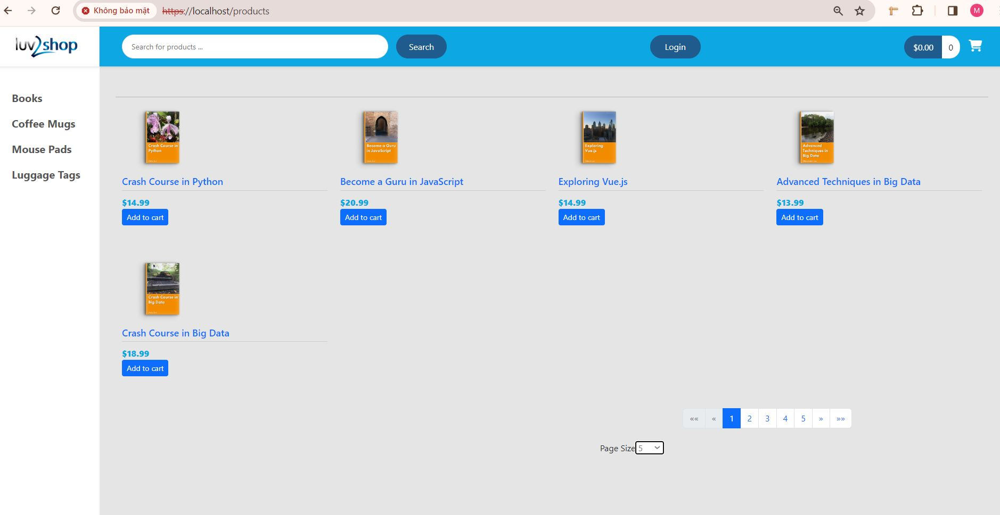
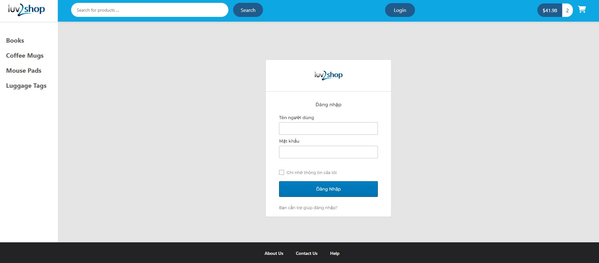
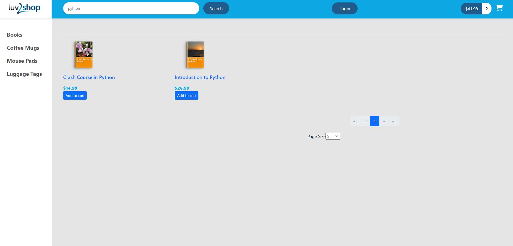
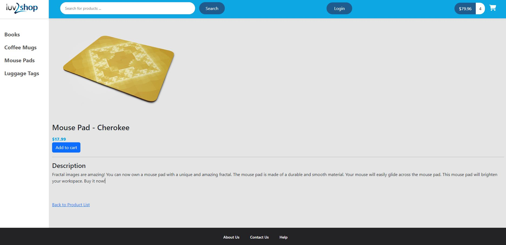
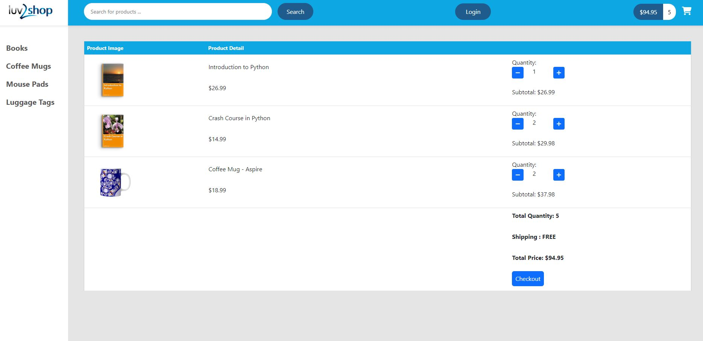
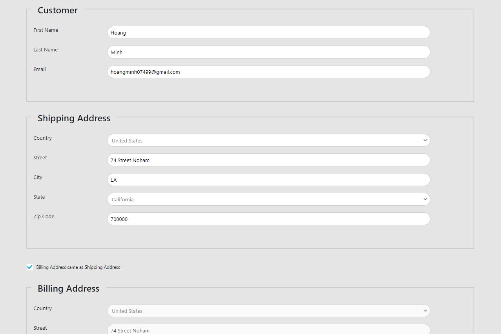
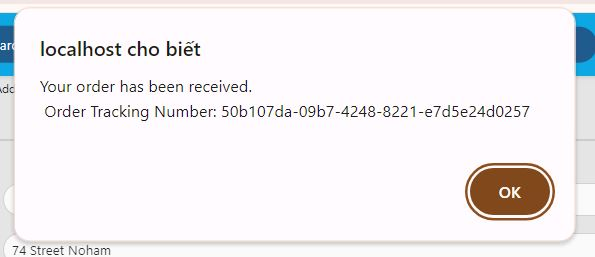
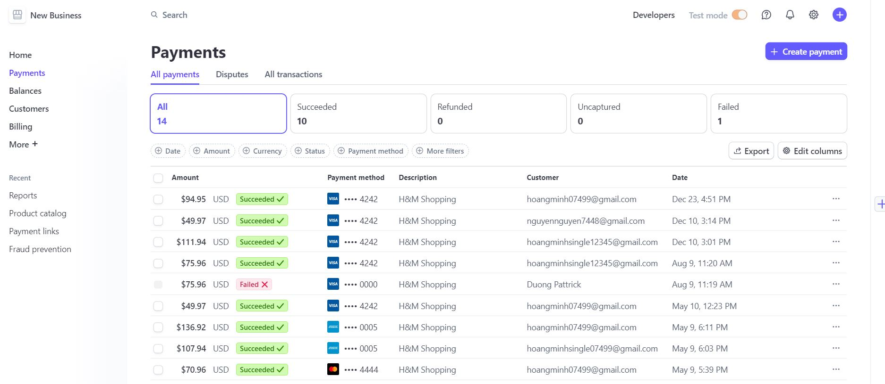
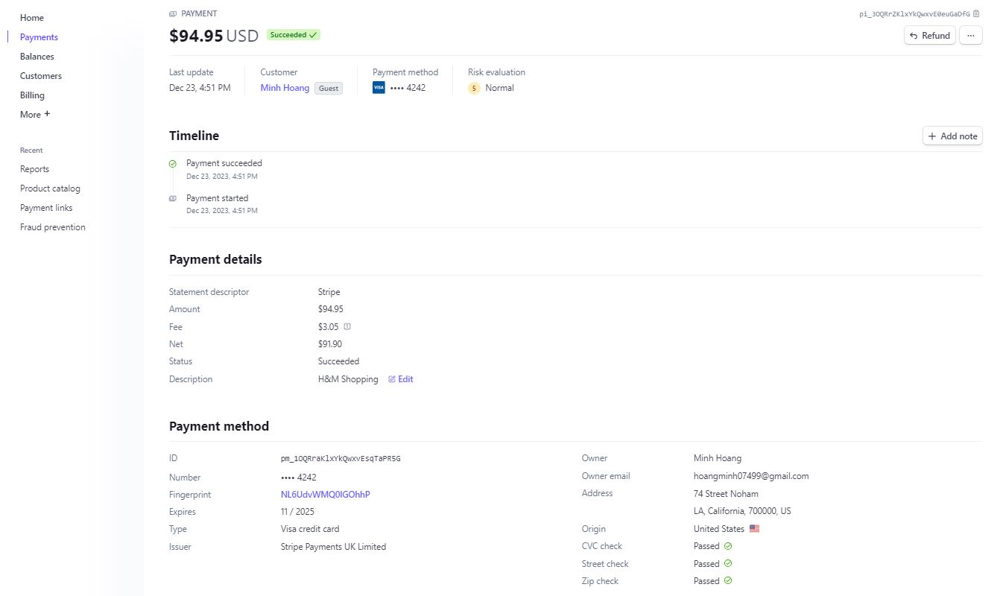
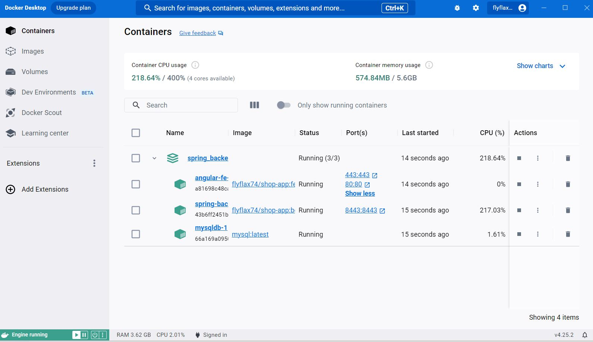

# Luv2-shop Ecommerce Website with Angular for front-end and Java for the server
## [1. Main Page](#s1)
## [2. Login Page](#s2)
## [3. Searching](#s3)
## [4. Product Detail](#s4)
## [5. Cart Page](#s5)
## [6. Check Out](#s6)
## [7. Success](#s7)
## [8. Payment](#s8)
## [9. Payment Detail](#s9)
## [10. Docker](#s10)
---

## 1. Main Page 
 

## 2. Login Page using Okta 

## 3. Searching 

## 4. Product Detail 

## 5. Cart Page 

## 6. Check Out 

## 7. Success 

## 8. Payment By Stripe 

## 9. Stripe Payment Detail 

## 10. Docker 

